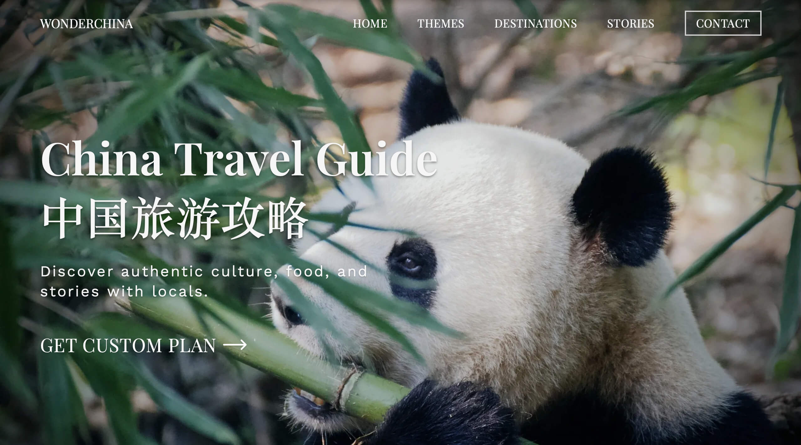

# 🇨🇳 China Travel Guide

Welcome to **WonderChina** – Your authentic guide to exploring China through real travel experiences!

This website is built on **genuine personal adventures** across China's diverse landscapes, from bustling megacities to remote villages, ancient temples to modern marvels. Whether you're planning your first trip to China or you're a seasoned traveler looking for hidden gems, you'll find practical insights and inspiring stories here.

🌐 Visit us at: [https://localtravelguide.fun](https://localtravelguide.fun)

---

## ✨ What Makes Us Different

- 🗺️ **Real Experiences**: Every destination featured has been personally visited and explored
- 🍜 **Local Insights**: Authentic food recommendations, cultural tips, and insider knowledge
- 🚄 **Practical Guides**: Detailed itineraries with transportation, timing, and budget information
- 🌏 **Bilingual Content**: Accessible to both international visitors and Chinese travelers
- 📱 **Modern Design**: Fast-loading, mobile-friendly website built with [Astro](https://astro.build)

---

## 🧭 Explore China With Us

### 🎯 Themed Routes
Follow curated journeys like the **IShowSpeed China Adventure**, **Silk Road Expedition**, or **Giant Panda Discovery Tour** – each route tells a story while providing practical travel information.

### 🏛️ Destinations by Region
From the **roof of the world in Tibet** to the **heavenly lakes of Xinjiang**, discover China's incredible diversity through detailed regional guides.

### 📖 Personal Travel Stories
Read about real adventures, unexpected discoveries, and cultural moments that make each journey memorable.

---

## 👩‍🎓 About the Creator

Hi, I'm **Wendy**! 👋

- 🎓 Graduate of a **US News Top 100 university**
- 🗣️ **Fluent English speaker** (TOEFL 101, IELTS 7.5)
- ✈️ **10+ years of travel experience** across China
- 📸 **Photography enthusiast** with an eye for capturing China's beauty
- 🌟 **Professional travel guide** passionate about sharing authentic experiences

I've personally visited **31 out of 34 provinces** in China, from the bustling streets of Shanghai to the serene temples of Tibet. Every guide on this website comes from my real adventures, mistakes I've made, and amazing discoveries along the way.

---

## 🎯 Our Mission

**To bridge cultures through authentic travel experiences**

Whether you're:
- 🌍 **An international visitor** planning your first trip to China
- 🇨🇳 **A Chinese traveler** looking to explore your own country deeper
- 🎒 **An experienced adventurer** seeking off-the-beaten-path destinations
- 🍜 **A food lover** wanting to taste authentic regional cuisines

You'll find valuable, tested advice that goes beyond typical tourist information.

---

## 🌟 What You'll Find Here

### 📍 **Detailed City Guides**
- Transportation tips and local customs
- Hidden gems known only to locals  
- Best times to visit each destination
- Budget breakdowns and practical advice

### 🍽️ **Authentic Food Experiences**
- Regional specialties and where to find them
- Street food safety and etiquette
- Restaurant recommendations from hole-in-the-wall to fine dining

### 🏛️ **Cultural Insights**
- Historical context that brings destinations to life
- Local customs and respectful travel practices
- Language tips and useful phrases

### 📱 **Modern Travel Tech**
- Apps that work in China
- Payment methods and digital tools
- Internet access and VPN considerations

---

## 💬 Get in Touch

Have questions about traveling in China? Need personalized advice for your trip?

📧 **Email**: wendy7756@outlook.com  
💬 **WhatsApp**: Join our travel community for instant tips and advice

I offer **FREE consultations** to help you plan your perfect China adventure!

---

## 🛠 Technical Details

This website is built with modern web technologies for the best user experience:

- ⚡ **Astro framework** for lightning-fast loading
- 📱 **Mobile-responsive design** 
- 🌐 **Bilingual support** (English & Chinese)
- 🔍 **SEO optimized** for better discoverability
- 📊 **Analytics enabled** to continuously improve content

---

*Last updated: January 2025*

**🌟 Start your China adventure today – explore, discover, and fall in love with this incredible country!**
