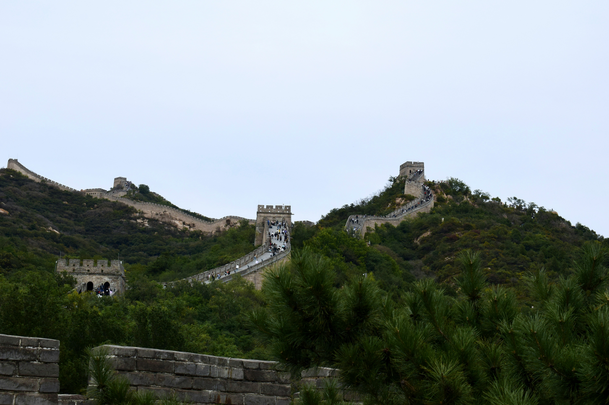
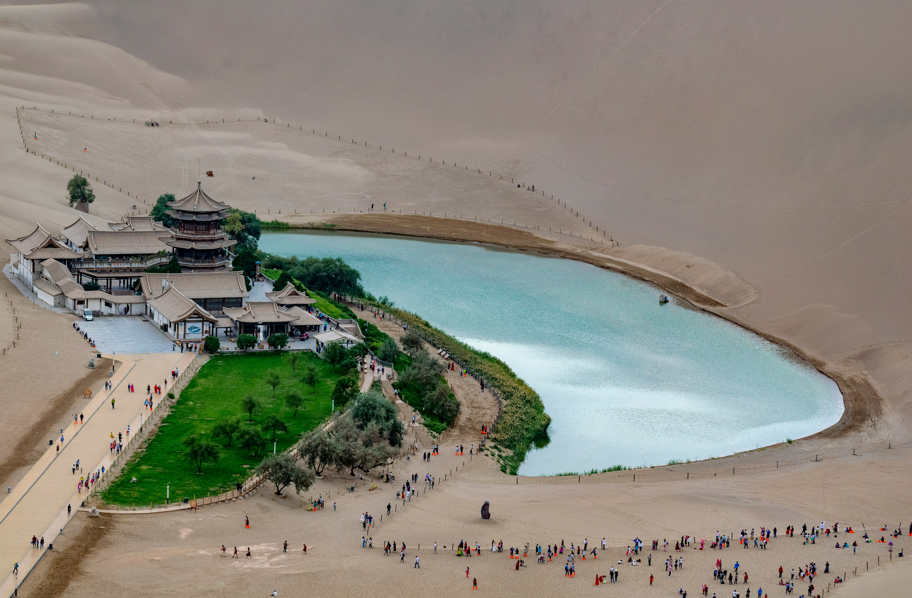
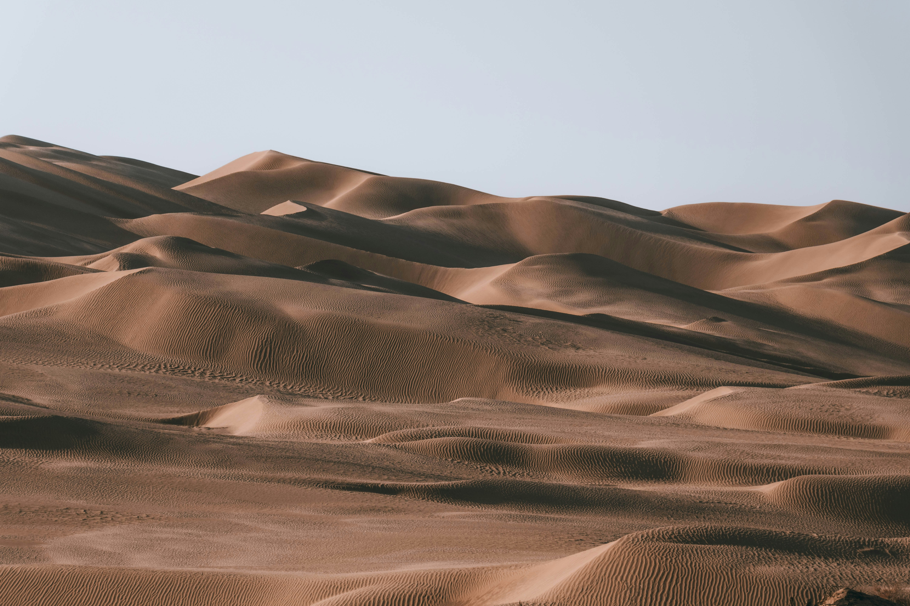
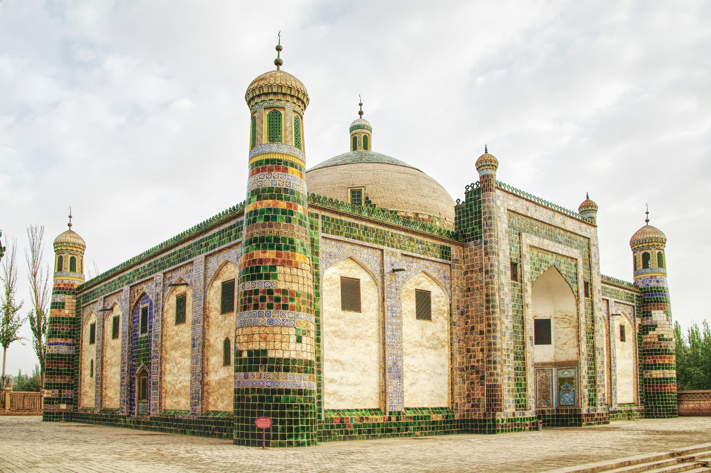

This route follows China’s legendary Silk Road, where merchants, monks, and explorers once crossed empires to trade silk, spices, and stories. From the imperial capital Xi’an to the desert gates of Kashgar, this journey connects history with breathtaking landscapes.  

 ## 📍 Xi’an 西安 
Once the eastern terminus of the Silk Road, Xi’an was home to 13 Chinese dynasties. Travelers begin at the ancient City Wall and visit the Terracotta Army, a vast tomb complex of China's first emperor. 
  
Notable spots: Terracotta Warriors 兵马俑, Big Wild Goose Pagoda 大雁塔, Ancient City Wall 古城墙 
Recommended food: Roujiamo 肉夹馍, Biangbiang noodles 油泼面 
  
 

 
 ## 📍 Zhangye 张掖 
Zhangye impresses with rainbow-colored Danxia landforms and its history as a military outpost. Marco Polo once passed through here on his Silk Road expedition. 
  
Notable spots: Zhangye Danxia National Park 张掖丹霞地貌, Giant Buddha Temple 大佛寺 
Recommended food: Beef noodles 牛肉面, Fried buns 炸馍馍 
  
 

 ## 📍 Jiayuguan 嘉峪关 
Marking the western end of the Great Wall, Jiayuguan Fortress was the last military defense before the desert. It's a dramatic gateway to China’s ancient frontier. 
  
Notable spots: Jiayuguan Pass 嘉峪关关城, Overhanging Great Wall 悬壁长城 
Recommended food: Camel meat stew 驼肉炖粉条, Handmade pulled noodles 拉面 
  
 

 ## 📍 Dunhuang 敦煌 
Famous for the Mogao Caves, Dunhuang is a Silk Road icon. It was a spiritual and artistic hub where Buddhist murals preserved centuries of intercultural heritage. 
  
Notable spots: Mogao Caves 莫高窟, Crescent Lake 月牙泉, Singing Sand Dunes 鸣沙山 
Recommended food: Stuffed camel hoof 驼蹄, Dunhuang noodles 敦煌面 
  
 

 ## 📍 Turpan 吐鲁番 
A desert oasis filled with grapes and ancient ruins. Turpan was vital for Silk Road travelers due to its underground karez irrigation system. 
  
Notable spots: Jiaohe Ruins 交河故城, Karez System 坎儿井, Flaming Mountains 火焰山 
Recommended food: Grape dishes 葡萄宴, Lamb kebabs 羊肉串 
  
 

 ## 📍 Urumqi 乌鲁木齐 
The capital of Xinjiang blends Han and Uyghur cultures. It offers Silk Road museums and scenic mountain views just beyond the city. 
  
Notable spots: Xinjiang Regional Museum 新疆博物馆, Tianshan 天山 
Recommended food: Naan bread 馕, Dapanji 大盘鸡 
  
 
 

 ## 📍 Kashgar 喀什 
This ancient trade city was a Silk Road crossroads. The Old Town is a vibrant maze of Uyghur culture, mosques, and bazaars that feel like stepping back in time. 
  
Notable spots: Id Kah Mosque 艾提尕尔清真寺, Sunday Bazaar 喀什大巴扎 
Recommended food: Polo pilaf 手抓饭, Samsa 烤包子 
  
 

